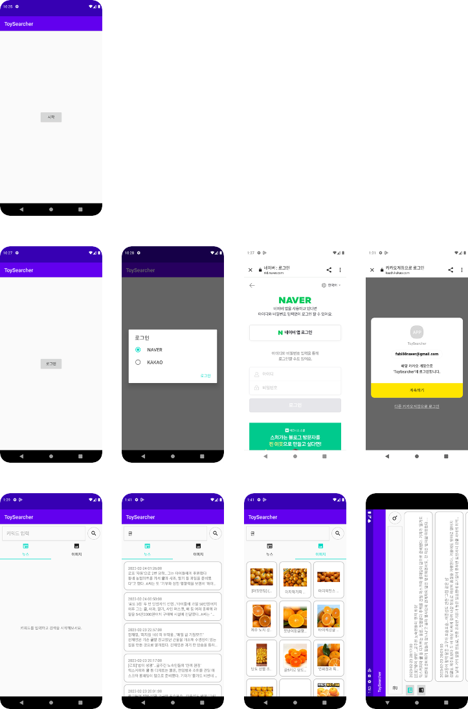
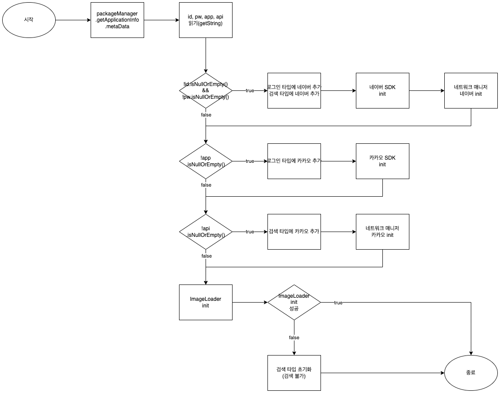
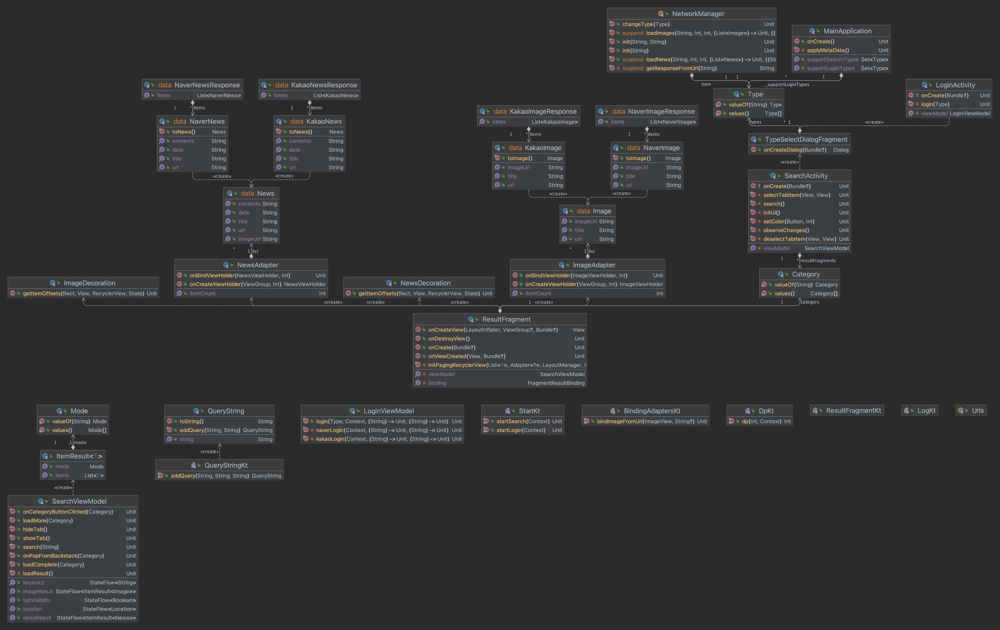

# ToySearcher
## 개요
- 로그인 및 뉴스와 이미지 검색 기능을 제공하는 앱을 제작한다.
- 다른 앱에서 사용할 수 있도록 라이브러리 형태로 제공한다.
- 라이브러리 사용자가 메타데이터를 입력하면 자동으로 확인하여 지원 가능한 기능만 제공한다.

### 제약 사항
- 네트워크 라이브러리를 사용하지 않는다.
- RecyclerView와 ConstraintLayout을 필수적으로 사용한다.
- 기타 UI 라이브러리를 사용하지 않는다.
- LiveData를 사용하지 않는다.
- minSdk는 21, targetSdk는 33으로 한다.
- 구현 과정에서 발생한 에러는 별도의 Error report를 작성한다.
- Error report는 발생한 오류, 원인, 수정 내용, 결과를 포함한다.
- 1일 이내에 해결하지 못할 경우 찾아본 내용을 포함하여 도움을 요청한다.

## 구조

- 전체 흐름도

- Application단의 흐름도

- 로그인 기능 흐름도

- 검색 기능 흐름도

- 결과 표시 기능 흐름도

- 클래스 다이어그램

